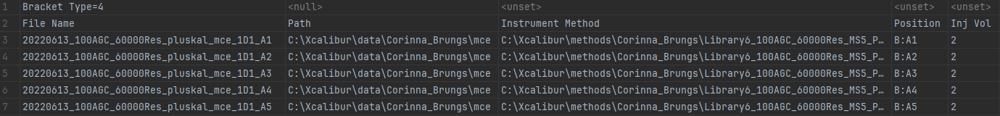
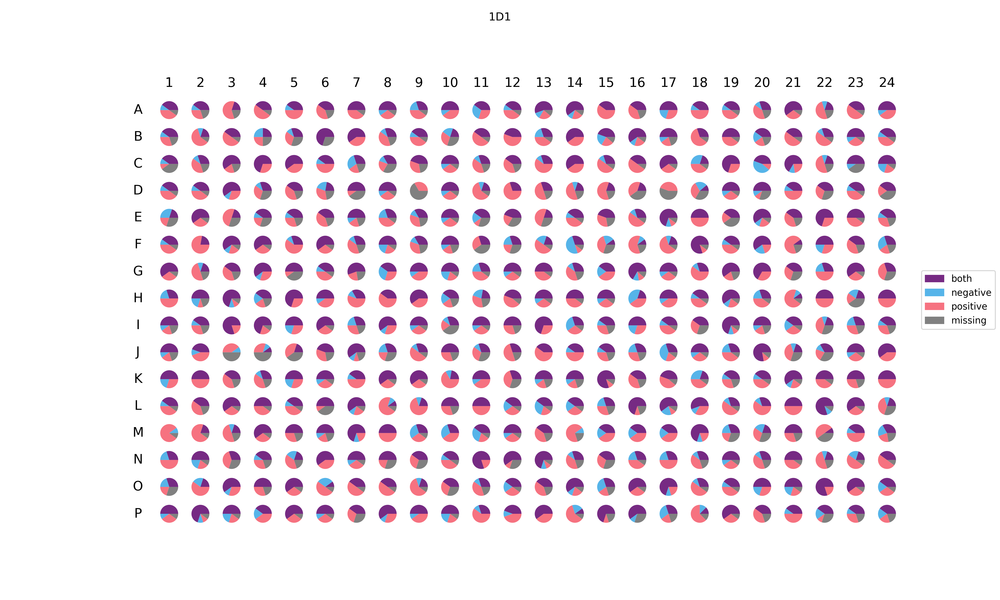

# Metadata cleanup

Please use the
[template](https://docs.google.com/spreadsheets/d/1v6_IlGS3VgycGc-mSSdNeocY-CFXpONVZbuh3XNLX2E/edit?usp=sharing)
for your metadata for having same column names and minimum needed information for the query. If no
structure information is provided, it is queried from PubChem by Name search.

For querying other databases, some need a local file and/or special access otherwise set it to
False in the jobs.py:

**Natural Product information**:

Dictionary of Natural Product (access):
[Link](https://www.routledge.com/go/the_dictionary_of_natural_products)

LOTUS: run `prepare_wikidata_lotus_prefect.py` for updating the data (otherwise use the provided
file)

**Drug information**

Broad institute - Drug Repurposing
Hub:
[Download](https://repo-hub.broadinstitute.org/repurposing#download-data)

DrugBank (access needed): [Download](https://go.drugbank.com/releases/latest) and
run `drugbank_extraction.py` on that file

DrugCentral (SQL dump file): [Download](https://drugcentral.org/download)

## Requirements for running:

```bash
pip install requirements
```

## run with prefect 2

```bash
prefect server start
```

Either remove the prefect.yaml and create new during deployment (see below) OR change the directory
within the file to your local path

- under pull:
    - prefect.deployments.steps.set_working_directory:
      directory: C:\path\to\your\project

Deployment:

- Start serving the flow locally by running `metadata_cleanup_prefect.py`, the service will then run
  and wait for jobs to be submitted (jobs.py)
- or by running deployment in the terminal

```bash
prefect deploy metadata_cleanup_prefect:cleanup_file --name local-deploy --pool local-work
```

Create new prefect.yaml if needed:

If prefect.yaml cannot be found, type n in the terminal for the two following questions, untill the
question appears to save configuration:
Would you like to save configuration for this deployment for faster deployments in the
future? [y/n]: y

## Create and run a worker pool

- create worker pool with the name defined in the deployment (e.g., see metadata_cleanup_prefect.py
  main).

```bash
prefect work-pool create --type process local-work
prefect work-pool update --concurrency-limit 5 local-work
```

### start worker in pool to process

```bash
prefect work-pool update --concurrency-limit 5 local-work
prefect worker start --pool local-work
```

## Run jobs

Define jobs in `jobs.py` and run on prefect deployment. The option to creat automatically chuncks of
your file are disabled for now.

# Sequence creation

The sequence creation is setup for the Orbitrap ID-X (Xcalibur). The metadatasheet needs to hava a
unique sample id, a plate name (batch identifier) as plate_id and the vial or well location as
well_location to run. For more information see sequence_creation.py.



# Well visualization (piechart if a compound mixture was used in each well)

The example shows a 384 well plate and each well contains 10 different compounds. Depending on their
polarity detection, the wells are colored as piecharts (ratio of detection).



For more information go to the [documentation](well_visualization.md).